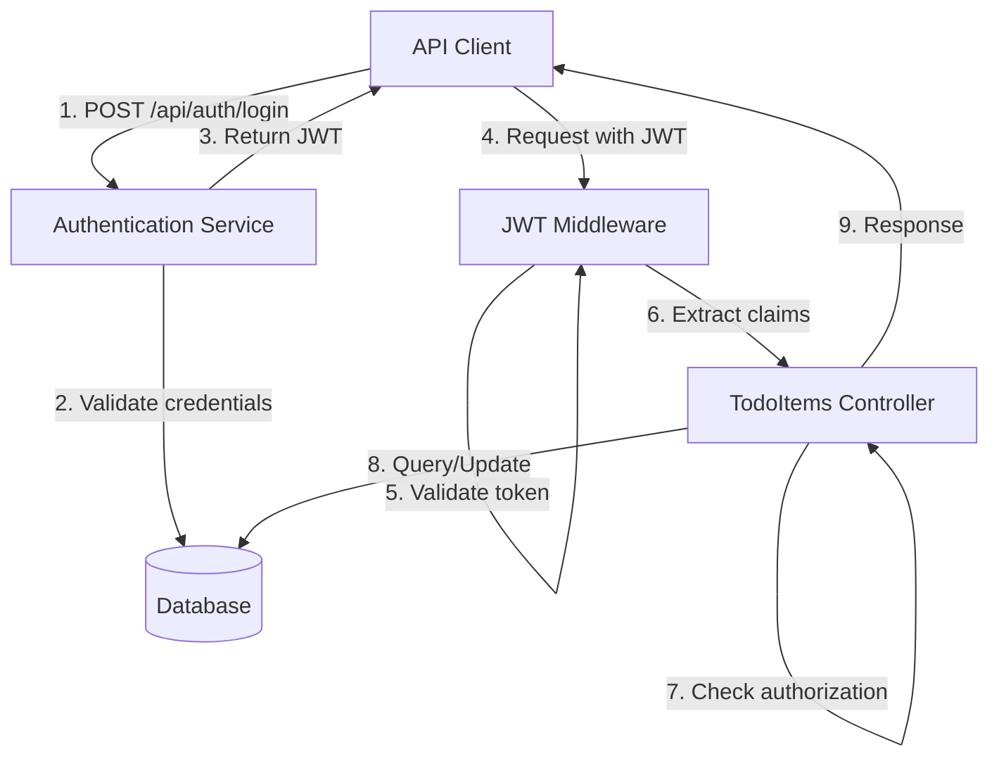
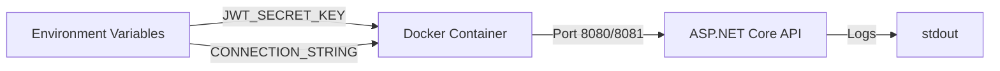

# Design Document: API Security and Deployment

## Overview

This design extends the existing ASP.NET Core 9.0 TodoItems API with JWT-based authentication, role-based authorization, and Docker containerization. The solution adds security layers without disrupting the existing API structure, enabling controlled access to endpoints based on user roles (admin/user) and providing a deployment-ready containerized application.

The design follows ASP.NET Core security best practices, leveraging built-in authentication middleware, and implements a minimal but complete authentication system suitable for production deployment.

## Architecture

### High-Level Architecture



### Component Architecture

The system consists of these primary components:

1. **Authentication Service**: Handles user registration, login, and JWT token generation
2. **JWT Middleware**: Validates tokens and populates user context for each request
3. **Authorization Policies**: Enforce role-based access control on endpoints
4. **User Repository**: Manages user data persistence and credential validation
5. **Configuration Provider**: Loads environment-specific settings securely
6. **Security Middleware**: Applies security headers and HTTPS enforcement

### Deployment Architecture




## Components and Interfaces

### 1. Authentication Service

**Responsibility**: User authentication and JWT token generation

**Interface**:
```csharp
public interface IAuthService
{
    Task<AuthResult> LoginAsync(LoginRequest request);
    Task<AuthResult> RegisterAsync(RegisterRequest request);
    Task<bool> ValidateCredentialsAsync(string username, string password);
}

public class AuthResult
{
    public bool Success { get; set; }
    public string Token { get; set; }
    public string ErrorMessage { get; set; }
    public DateTime? ExpiresAt { get; set; }
}
```

**Implementation Details**:
- Uses `System.IdentityModel.Tokens.Jwt` for token generation
- Integrates with `IPasswordHasher<User>` for secure password hashing
- Loads JWT secret and expiration from configuration
- Returns standardized result objects for success/failure cases

### 2. Authentication Controller

**Responsibility**: Exposes authentication endpoints

**Endpoints**:
- `POST /api/auth/login` - Authenticate user and return JWT
- `POST /api/auth/register` - Create new user account

**Implementation**:
```csharp
[Route("api/[controller]")]
[ApiController]
public class AuthController : ControllerBase
{
    private readonly IAuthService _authService;
    
    [HttpPost("login")]
    public async Task<ActionResult<LoginResponse>> Login(LoginRequest request);
    
    [HttpPost("register")]
    public async Task<ActionResult<RegisterResponse>> Register(RegisterRequest request);
}
```


### 3. User Repository

**Responsibility**: User data persistence and retrieval

**Interface**:
```csharp
public interface IUserRepository
{
    Task<User> GetByUsernameAsync(string username);
    Task<User> GetByIdAsync(int id);
    Task<User> CreateAsync(User user);
    Task<bool> UsernameExistsAsync(string username);
    Task UpdateRoleAsync(int userId, string role);
}
```

**Implementation Details**:
- Uses Entity Framework Core for data access
- Stores users in the same database as TodoItems
- Supports async operations for scalability

### 4. JWT Configuration

**Responsibility**: Centralized JWT settings

**Configuration Model**:
```csharp
public class JwtSettings
{
    public string SecretKey { get; set; }
    public int ExpirationMinutes { get; set; } = 60;
    public string Issuer { get; set; }
    public string Audience { get; set; }
}
```

**Loading Strategy**:
- Primary: Environment variables (`JWT_SECRET_KEY`, `JWT_EXPIRATION_MINUTES`)
- Fallback: appsettings.json (for development only)
- Validation: Fail fast on startup if `JWT_SECRET_KEY` is missing in production


### 5. Authorization Policies

**Responsibility**: Define role-based access rules

**Policy Definitions**:
```csharp
builder.Services.AddAuthorization(options =>
{
    options.AddPolicy("RequireAdminRole", policy => 
        policy.RequireRole("admin"));
    
    options.AddPolicy("RequireAuthenticatedUser", policy => 
        policy.RequireAuthenticatedUser());
});
```

**Application**:
- Read endpoints (GET): Require authentication (any role)
- Write endpoints (POST/PUT/DELETE): Require admin role

### 6. Security Middleware

**Responsibility**: Apply security headers and HTTPS enforcement

**Headers Applied**:
- `Strict-Transport-Security`: max-age=31536000
- `X-Content-Type-Options`: nosniff
- `X-Frame-Options`: DENY
- `X-XSS-Protection`: 1; mode=block

**Implementation**:
- Custom middleware for header injection
- HTTPS redirection in production mode
- CORS configuration with whitelist support

### 7. Health Check Services

**Responsibility**: Provide health and readiness endpoints

**Endpoints**:
- `/health` - Basic health check (always returns 200 if app is running)
- `/ready` - Readiness check (verifies database connectivity)

**Implementation**:
```csharp
builder.Services.AddHealthChecks()
    .AddDbContextCheck<TodoContext>("database");
```


## Data Models

### User Model

```csharp
public class User
{
    public int Id { get; set; }
    public string Username { get; set; }
    public string PasswordHash { get; set; }
    public string Role { get; set; } // "admin" or "user"
    public DateTime CreatedAt { get; set; }
    public DateTime? LastLoginAt { get; set; }
}
```

**Constraints**:
- Username: Required, unique, max 50 characters
- PasswordHash: Required, stores bcrypt/PBKDF2 hash
- Role: Required, must be "admin" or "user"

### Database Context Extension

```csharp
public class TodoContext : DbContext
{
    public DbSet<TodoItem> TodoItems { get; set; }
    public DbSet<User> Users { get; set; } // New
    
    protected override void OnModelCreating(ModelBuilder modelBuilder)
    {
        modelBuilder.Entity<User>()
            .HasIndex(u => u.Username)
            .IsUnique();
            
        modelBuilder.Entity<User>()
            .Property(u => u.Role)
            .HasDefaultValue("user");
    }
}
```

### Request/Response DTOs

**LoginRequest**:
```csharp
public class LoginRequest
{
    [Required]
    public string Username { get; set; }
    
    [Required]
    public string Password { get; set; }
}
```


**LoginResponse**:
```csharp
public class LoginResponse
{
    public string Token { get; set; }
    public DateTime ExpiresAt { get; set; }
    public string Username { get; set; }
    public string Role { get; set; }
}
```

**RegisterRequest**:
```csharp
public class RegisterRequest
{
    [Required]
    [StringLength(50, MinimumLength = 3)]
    public string Username { get; set; }
    
    [Required]
    [StringLength(100, MinimumLength = 8)]
    public string Password { get; set; }
    
    public string Role { get; set; } = "user";
}
```

**RegisterResponse**:
```csharp
public class RegisterResponse
{
    public int UserId { get; set; }
    public string Username { get; set; }
    public string Role { get; set; }
}
```

### Docker Configuration

**Dockerfile**:
```dockerfile
# Build stage
FROM mcr.microsoft.com/dotnet/sdk:9.0 AS build
WORKDIR /src
COPY ["API web/API web.csproj", "API web/"]
RUN dotnet restore "API web/API web.csproj"
COPY . .
WORKDIR "/src/API web"
RUN dotnet build "API web.csproj" -c Release -o /app/build
RUN dotnet publish "API web.csproj" -c Release -o /app/publish

# Runtime stage
FROM mcr.microsoft.com/dotnet/aspnet:9.0 AS runtime
WORKDIR /app
EXPOSE 8080
EXPOSE 8081
COPY --from=build /app/publish .
ENTRYPOINT ["dotnet", "API web.dll"]
```


**docker-compose.yml**:
```yaml
version: '3.8'
services:
  api:
    build:
      context: .
      dockerfile: Dockerfile
    ports:
      - "8080:8080"
      - "8081:8081"
    environment:
      - ASPNETCORE_ENVIRONMENT=Production
      - JWT_SECRET_KEY=${JWT_SECRET_KEY}
      - JWT_EXPIRATION_MINUTES=60
      - CONNECTION_STRING=Data Source=todos.db
    volumes:
      - ./data:/app/data
```

## Correctness Properties

*A property is a characteristic or behavior that should hold true across all valid executions of a system—essentially, a formal statement about what the system should do. Properties serve as the bridge between human-readable specifications and machine-verifiable correctness guarantees.*

### Property 1: JWT Token Structure Completeness

*For any* valid user authentication, the generated JWT token must contain claims for user identifier, username, and role, and must be signed with the configured secret key.

**Validates: Requirements 1.2, 1.4, 1.6**

### Property 2: Invalid Credentials Rejection

*For any* invalid username/password combination, the authentication service must return HTTP 401 Unauthorized with an error message.

**Validates: Requirements 1.3**

### Property 3: Token Expiration Configuration

*For any* generated JWT token, the expiration time must be set to the configured duration (default 60 minutes) from the time of generation.

**Validates: Requirements 1.5**

### Property 4: Valid Token Acceptance

*For any* request with a valid, non-expired JWT token in the Authorization header, the middleware must successfully extract user identity and role claims and allow the request to proceed to authorization checks.

**Validates: Requirements 2.1**


### Property 5: Expired Token Rejection

*For any* request with an expired JWT token, the middleware must return HTTP 401 Unauthorized.

**Validates: Requirements 2.2**

### Property 6: Malformed Token Rejection

*For any* malformed or invalid JWT token (including tokens with invalid signatures), the middleware must return HTTP 401 Unauthorized.

**Validates: Requirements 2.3, 2.5**

### Property 7: Unauthenticated Request Rejection

*For any* request to a protected endpoint without an Authorization header or with invalid authentication, the API must return HTTP 401 Unauthorized.

**Validates: Requirements 2.4, 3.3, 3.4, 4.7**

### Property 8: Authenticated Read Access

*For any* authenticated user with "user" or "admin" role, GET requests to /api/todoitems and /api/todoitems/{id} must succeed and return the requested data.

**Validates: Requirements 3.1, 3.2**

### Property 9: Admin Write Access

*For any* authenticated user with "admin" role, POST, PUT, and DELETE requests to todo item endpoints must succeed and perform the requested operation.

**Validates: Requirements 4.1, 4.3, 4.5**

### Property 10: User Role Write Restriction

*For any* authenticated user with "user" role, POST, PUT, and DELETE requests to todo item endpoints must return HTTP 403 Forbidden.

**Validates: Requirements 4.2, 4.4, 4.6**

### Property 11: Password Hashing Security

*For any* registered user password, the stored password hash must not equal the plaintext password and must be verifiable using the configured hashing algorithm.

**Validates: Requirements 8.2**

### Property 12: User Registration Round-Trip

*For any* successfully registered user, retrieving the user from persistent storage must return the same username and role that were provided during registration.

**Validates: Requirements 8.3**


### Property 13: Duplicate Username Prevention

*For any* username that already exists in the system, attempting to register a new user with that username must fail with an appropriate error.

**Validates: Requirements 8.4**

### Property 14: Role Update Authorization

*For any* admin user and any valid user ID, POST requests to /api/users/{id}/role must successfully update the user's role.

**Validates: Requirements 8.5**

### Property 15: HTTPS Redirection in Production

*For any* HTTP request when running in production mode, the API must redirect to the HTTPS equivalent.

**Validates: Requirements 9.1**

### Property 16: Security Headers Presence

*For any* API response, the following security headers must be present with correct values: Strict-Transport-Security (max-age >= 31536000), X-Content-Type-Options (nosniff), X-Frame-Options (DENY), and X-XSS-Protection (1; mode=block).

**Validates: Requirements 9.2, 9.3, 9.4, 9.5**

### Property 17: CORS Origin Restriction

*For any* request from an origin not in the configured whitelist (when CORS is enabled), the API must reject the request or not include CORS headers in the response.

**Validates: Requirements 9.6**

### Property 18: Authentication Event Logging

*For any* authentication attempt (successful or failed), the API must create a log entry containing the username, timestamp, and outcome.

**Validates: Requirements 10.1, 10.2**

### Property 19: Authorization Failure Logging

*For any* authorization failure (HTTP 403), the API must log the username, requested endpoint, and required role.

**Validates: Requirements 10.3**

### Property 20: Invalid Token Logging

*For any* invalid JWT token received, the API must log the validation failure reason.

**Validates: Requirements 10.4**


### Property 21: Exception Logging

*For any* unhandled exception, the API must log the exception message and stack trace.

**Validates: Requirements 10.5**

### Property 22: Health Endpoint Unauthenticated Access

*For any* request to /health or /ready endpoints without authentication, the request must succeed (not return 401).

**Validates: Requirements 11.4**

### Property 23: Health Endpoint Response Time

*For any* request to health check endpoints, the response must be returned within 5 seconds.

**Validates: Requirements 11.5**

### Property 24: Swagger Endpoint Documentation

*For any* API endpoint, the Swagger/OpenAPI document must include the endpoint's request schema, response schema, and security requirements (if protected).

**Validates: Requirements 12.3, 12.4**

## Error Handling

### Authentication Errors

**Invalid Credentials (401)**:
- Response: `{ "error": "Invalid username or password" }`
- Logged: Username attempt and failure reason
- No sensitive information leaked (don't indicate if username exists)

**Expired Token (401)**:
- Response: `{ "error": "Token has expired" }`
- Logged: Token expiration time and request time
- Client should re-authenticate

**Malformed Token (401)**:
- Response: `{ "error": "Invalid token format" }`
- Logged: Token validation error details
- Prevents information leakage about token structure

### Authorization Errors

**Insufficient Permissions (403)**:
- Response: `{ "error": "Insufficient permissions for this operation", "required_role": "admin" }`
- Logged: Username, endpoint, required role, actual role
- Clear indication of what's needed


**Missing Authentication (401)**:
- Response: `{ "error": "Authentication required" }`
- Logged: Endpoint accessed without authentication
- Standard WWW-Authenticate header included

### Registration Errors

**Duplicate Username (409)**:
- Response: `{ "error": "Username already exists" }`
- Logged: Registration attempt with duplicate username
- HTTP 409 Conflict status code

**Invalid Password (400)**:
- Response: `{ "error": "Password must be at least 8 characters" }`
- Validation errors returned clearly
- No password logged

**Invalid Role (400)**:
- Response: `{ "error": "Role must be 'admin' or 'user'" }`
- Prevents invalid role assignments

### Configuration Errors

**Missing JWT Secret (Startup Failure)**:
- Behavior: Application fails to start
- Logged: "FATAL: JWT_SECRET_KEY environment variable not configured"
- Exit code: 1
- Prevents running with insecure configuration

**Invalid Configuration Values**:
- Behavior: Application fails to start or uses safe defaults
- Logged: Configuration validation errors
- Examples: Invalid expiration duration, malformed connection string

### Database Errors

**Connection Failure**:
- Response: HTTP 503 Service Unavailable (for /ready endpoint)
- Logged: Database connection error details
- Retry logic: Exponential backoff for transient failures

**Constraint Violations**:
- Response: HTTP 409 Conflict or 400 Bad Request
- Logged: Constraint violation details
- User-friendly error messages
